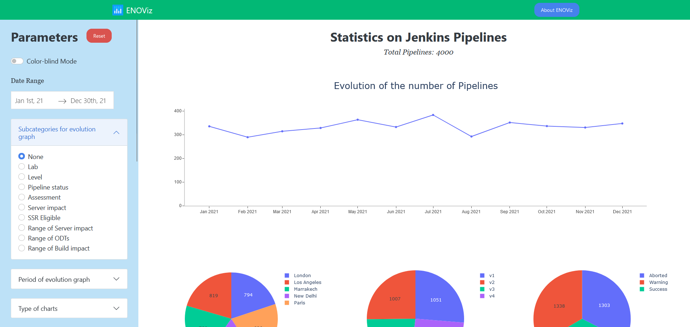

# Context of the project

During one of my internships, I have created this visualizing tool in order to describe anf familiarize with the dataset of pipelines that I had to work with. It was later used by all my team because it presented a very useful general overview on the Jenkins pipelines.

**Observation:** For confidentiality reasons, all the values represented here are randomly generated and erroneous. 


# Overview of the application 

The application has three main parts :
- The navigation bar: It contains an "About Enoviz" button summarizing the purpose of the tool.

- The sidebar: containing different parameters. These parameters allow you to change the type of graphs (eg. Pie or Bar charts), there content (eg. Adding subcategories in the graph of evolution of pipelines in time), or apply a filter in the pipelines displayed (eg. Specify a particular Lab, Level, Pipeline status,..).

- The graphs: Ten graphs are presented. The first one demonstrates the variation of the number of Pipelines per a certain period of time defined in the Parameters sidebar (default = Month). Each of the next 9 graphs illustrates the propotions of groups of pipelines in the form of Pie charts (default) or Bar charts (Option in the Parameters). These groups are formed according to respectively the lab, the level, the status, the assessment, the server impact of the pipelines and the number of ODTs to replay and build impacts for both Windows and Linux.


A screenshot of the app is shown below.




# Installation

## Try the application on a dev server

The fastest way to run the web app to familarize with its content is to run it locally on a dev server. 

1. First, download or clone the repository in your device.

2. Create a virtual environment in your folder by running in your prompt command the commands bellow. Remember to change [path] with the path of your folder.

```
cd [path]
pip install virtualenv 
virtualenv env 
```

If you are using Linux, run the command bellow to activate your virtual environment:
```
source env/bin/activate
```

If you are using Windows, run instead:
```
$ .\env\Scripts\activate
```

3. Once your virtual environment is activated, you can install all the python packages required to run the application by typing:
```
pip install -r requirements.txt
```
4. 1. Open run_enoviz.py in your favorite IDE and make sure the following lines are uncommented: 

Line 41-42
```python
# For dev server:
app = dash.Dash(__name__,  external_stylesheets=[dbc.themes.LITERA])
```


And line 216-217
```python
# For dev server:
app.run_server(debug=True)
```
4. 2. Then comment the following line (Line 213-214) 

```python
    # If dev server, comment the following line:
    #flask_app.run(host = '0.0.0.0:8050', debug=True)
```

5. Now everything is ready to run the web app. Type the command:
```
python run_enoviz.py
```

In your command prompt, the url where the application is running should be stated in the last line. In my case:
```
Dash is running on http://127.0.0.1:8050/
```

## Using Docker and Gunicorn WSGI

Before proceeding, I invite you to install Docker in your device. Visit https://docs.docker.com/get-docker/ .

**Warning:** Because Gunicorn only runs on Linux, this is a Linux Docker container. If you are using Windows 10, make sure to have Hyper-V isolation enabled (Docker asks to enable Hyper-V during installation), or use a Virtual Machine with a Linux distribution (This last option is *not recommended*). You can always run the application in a dev server, see the instructions above.

1. First you need to build the Docker image. In your command prompt, type the following command:

```
sudo docker build -t enoviz_image .
```
You can change the tag of the Docker image as you wish (here we tagged it enoviz_image).

2. Then run the docker image to build a docker container (we named it enoviz_conatainer) by executing the command:

```
sudo docker run -p 8050:8050 --name enoviz_container enoviz_image 
```

You can also run the image on background (detached mode) by adding the option -d:

```
sudo docker run -d -p 8050:8050 --name enoviz_container enoviz_image 
```

The docker container should be built now and the application running

In Dockerfile, you can see that we asked gunicorn to run the app on the generic ip adress **0.0.0.0**, so you can access the app by typing in your browser **http://localhost:8050**.

NB: If you have run the image on detached mode, you can kill your container using the command :

```
sudo docker kill enoviz_container
```

## Useful Docker commands

List existing docker containers
```
sudo docker container ls -a
```

ou bien 
```
sudo docker ps -a
```

Kill (stop) a docker container
```
sudo docker kill [Name or ID of container]
```

Remove existing docker container
```
sudo docker rm -f [Name or ID of container]
```

List existing docker images 
```
sudo docker image ls
```

Remove existing docker image
```
sudo docker image rm -f [Name or ID of image]
```
**WARNING:** The command above does not remove an image if it has a container. The command will only untag the image. Remove all image containers before proceeding. 

